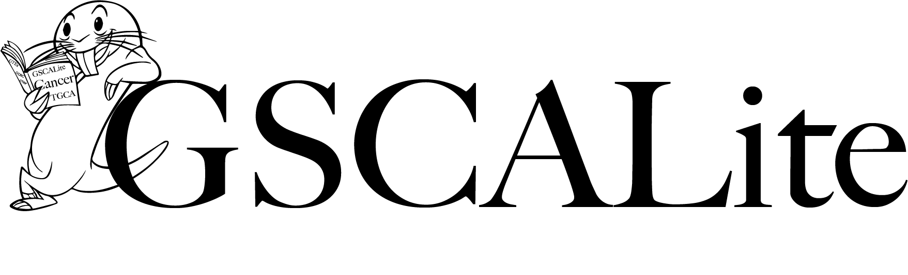

# GSCALite

## Scripts

1. Follow the **creatly** diagram or change the diagram as you need.
2. We build the whole webserver with shiny and shiny related packages. 
3. For ui design, please follow the ui as shiny provided [tags](http://shiny.rstudio.com/articles/tag-glossary.html). Try not to use write raw HTML.
4. For server parts, you can use the [module design](http://shiny.rstudio.com/articles/modules.html) as shiny provided. Or, use `source` to load the outer scripts in `server` directory.
5. The code style is important, you can follow tidyverse recommened [code style](http://style.tidyverse.org/).

## Collaborations

Please try to collaborate with each other through GitHub, you can read two articles to learn collaboration with GitHub.

1. [Git Workflows for Pros: A Good Git Guide](https://www.toptal.com/git/git-workflows-for-pros-a-good-git-guide)

2. [Collaboration: Git Development Workflow](https://github.com/structureddynamics/OSF-Web-Services/wiki/Collaboration:-Git-Development-Workflow)

> Huffyphenix Joined the team

> Import the project logo.

