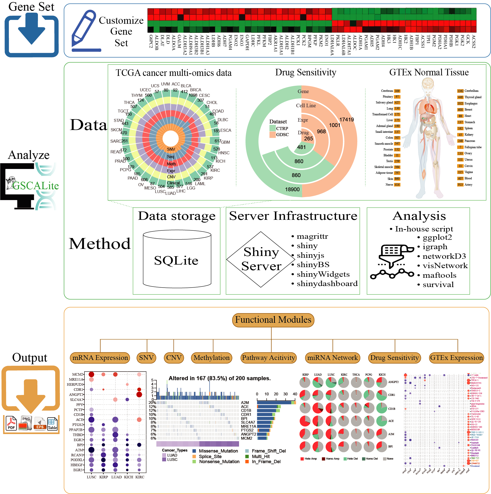

# GSCALite

> Although longitudinal genomic data are currently not available, the large number of patients enabled the use of the concept of statistical ensemble, that is averaging large numbers of patients per stage represents a snap shot of the underlying process.

## Citation
[GSCALite: A Web Server for Gene Set Cancer Analysis.](https://academic.oup.com/bioinformatics/advance-article/doi/10.1093/bioinformatics/bty411/5001392) Chun-Jie Liu,  Fei-Fei Hu,  Mengxuan Xia,  Leng Han,  Qiong Zhang,  An-Yuan Guo. Bioinformatics. (2018).

## Summary
The availability of cancer genomic data makes it possible to analyze genes related to cancer. Cancer is usually the result of a set of genes and the signal of a single gene could be covered by background noise. Here, we present a web server named Gene Set Cancer Analysis (GSCALite) to analyze a set of genes in cancers with the following functional modules. (i) Differential expression in tumor vs normal, and the survival analysis; (ii) Genomic variations and their survival analysis; (iii) Gene expression associated cancer pathway activity; (iv) miRNA regulatory network for genes; (v) Drug sensitivity for genes; (vi) Normal tissue expression and eQTL for genes. GSCALite is a user-friendly web server for dynamic analysis and visualization of gene set in cancer and drug sensitivity correlation, which will be of broad utilities to cancer researchers.

## Platform Logo

## The workflow of GSCALite

